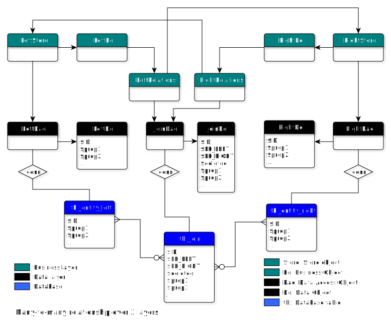

[](https://bhenkmsdata.readthedocs.io/en/latest/?badge=latest)


# msData-d

**Basic Data Object and Data Access Object implementations for MySql database**

* msData is written in PHP
* Requirement: php >=8.1
* Tested against MySql version 8.0.32
* Documentation: http://bhenkmsdata.rtfd.io/

## Installation

```
composer require bhenk/msdata
```

## Configuration

See [MySqlConnector](https://bhenkmsdata.readthedocs.io/en/latest/api/bhenk/msdata/connector/MysqlConnector/MysqlConnector.html#mysqlconnector).

## Usage
* Extend the Data Object [Entity](https://bhenkmsdata.readthedocs.io/en/latest/api/bhenk/msdata/abc/Entity/Entity.html#entity)
* Extend the Data Access Object [AbstractDao](https://bhenkmsdata.readthedocs.io/en/latest/api/bhenk/msdata/abc/AbstractDao/AbstractDao.html#abstractdao)
* Run [AbstractDao::createTable](https://bhenkmsdata.readthedocs.io/en/latest/api/bhenk/msdata/abc/AbstractDao/AbstractDao.html#abstractdao-createtable) once.

### Creation of tables
Data types _string_, _int_, _bool_ and _float_, when used in Entities will
be converted to proper database types automatically. Caveat: String is 
converted to _VARCHAR(255)_. If your strings are larger you'll have to
override the method
[AbstractDao::getCreateTableStatement](https://bhenkmsdata.readthedocs.io/en/latest/api/bhenk/msdata/abc/AbstractDao/AbstractDao.html#abstractdao-getcreatetablestatement)
with your own.

### Simple Data Objects
msData is on purpose kept simple. There will be one table for each
Data Object. Data Objects have only primitive types: _string_, _int_, 
_bool_ and _float_. Extend Entity, create a constructor for all your
Data Object fields, generate getters and setters, and you're basically done.
The corresponding Data Access Object needs only implementing of two methods:
[getDataObjectName](https://bhenkmsdata.readthedocs.io/en/latest/api/bhenk/msdata/abc/AbstractDao/AbstractDao.html#abstractdao-getdataobjectname)
and [getTableName](https://bhenkmsdata.readthedocs.io/en/latest/api/bhenk/msdata/abc/AbstractDao/AbstractDao.html#abstractdao-gettablename).

### Complexity in your business layer
Mixes of different entities is foreseen to take place in
your business layer. For instance PersonWithAddress(es) is a mix of the
Data Objects PersonDo and (one or more) AddressDo. Objects like Date,
Time, DateTime etc. are represented in your Data Objects as strings,
or other primitive types,
though they may be represented in the database with appropriate types
and queried as such. 

### Relations
The Data Access Object 
[AbstractJoinDao](https://bhenkmsdata.readthedocs.io/en/latest/api/bhenk/msdata/abc/AbstractJoinDao/AbstractJoinDao.html#abstractjoindao)
and Data Object 
[Join](https://bhenkmsdata.readthedocs.io/en/latest/api/bhenk/msdata/abc/Join/Join.html#join)
can be used to express many-to-many relationships, based on a join-table with foreign keys. 
Below is a complete diagram covering database, data-layer and business-layer.



Business Objects (Bo’s) are created by their corresponding Store Object. 
Store Objects rely on their Data Access Object (Dao) to materialize the type of Bo. 
Bo’s have a dependency on their Relations Object which in turn has a dependency on 
the opposite Store Object, in order to materialize the opposite ends of the relation. 
Relations Objects may have lazy methods to fetch their (Join) Data Objects and 
related Bo’s, in order to keep database traffic at a minimum.

After a Store Object has persisted a Bo, it calls on the Relations Object to 
persist the relations.

A Relations Object may keep track of more than one type of relation, so Bo’s can have 
multiple relations to multiple other Bo-types. For each type of relation the Relations 
Object than has distinguished Dao’s and Do’s, backed by separate join tables.

Although there are no objections to complete symmetry, adding and removing of relations 
is often done from one side only, while the other side has readonly methods on their 
Relations Object. So for instance a Person can add and remove Addresses, while from 
the Address Object you can only obtain which Persons are living or working there.
